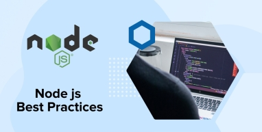

By continuing to use this website you agree to our [Cookie
Policy.](https://www.tatvasoft.com/privacy-statement "Cookie Policy") I
Agree

hamburger menu

-   [Services](https://www.tatvasoft.com/software-development-services/software-development-services)
    Back
    -   [Custom Software
        Development](https://www.tatvasoft.com/software-development-services/custom-software-development)
    -   [Web
        Development](https://www.tatvasoft.com/software-development-services/web-development)
    -   [Dedicated Development
        Team](https://www.tatvasoft.com/software-development-services/dedicated-development-team)
    -   [AI
        Development](https://www.tatvasoft.com/software-development-services/ai-software-development-services "AI Development")
    -   [Software Product
        Development](https://www.tatvasoft.com/software-development-services/product-development-maintenance)
    -   [Ecommerce
        Development](https://www.tatvasoft.com/software-development-services/ecommerce-development)
    -   [Mobile App
        Development](https://www.tatvasoft.com/software-development-services/mobile-app-development)
    -   [Software Testing &
        QA](https://www.tatvasoft.com/software-development-services/testing-qa)
    -   [UI/UX
        Design](https://www.tatvasoft.com/software-development-services/ui-ux-design-services)

    
-   [Technologies](https://www.tatvasoft.com/software-development-technology)
    Back
    -   Backend

        -   [.NET](https://www.tatvasoft.com/software-development-technology/microsoft-dot-net)
        -   [Java](https://www.tatvasoft.com/software-development-technology/java-development)
        -   [Node
            Js](https://www.tatvasoft.com/software-development-technology/node-js-development)
        -   [PHP](https://www.tatvasoft.com/software-development-technology/php-development-india)
        -   [ROR](https://www.tatvasoft.com/software-development-technology/ruby-on-rails-development)
        -   [Python](https://www.tatvasoft.com/software-development-technology/python-development)

    -   Frontend

        -   [Angular](https://www.tatvasoft.com/software-development-technology/angular-development-services)
        -   [React](https://www.tatvasoft.com/software-development-technology/react-development-services)
        -   [Vue
            Js](https://www.tatvasoft.com/software-development-technology/vue-js-development-services)

    -   Mobile

        -   [iOS](https://www.tatvasoft.com/software-development-technology/iphone-development)
        -   [Android](https://www.tatvasoft.com/software-development-technology/android-app-development)
        -   [React
            Native](https://www.tatvasoft.com/software-development-technology/react-native-apps)
        -   [Flutter](https://www.tatvasoft.com/software-development-technology/flutter-app-development)

    -   Others

        -   [Sharepoint](https://www.tatvasoft.com/software-development-technology/sharepoint-development)
        -   [Cloud &
            Devops](https://www.tatvasoft.com/software-development-technology/cloud-and-devops)
-   <a href="#" onclick="event.preventDefault();" aria-haspopup="true"
    aria-expanded="false" title="Industries">Industries</a>
    Back
    -   [Finance](https://www.tatvasoft.com/industries/banking-finance-insurance-software-solutions)
    -   [Insurance](https://www.tatvasoft.com/industries/insurance-software-development)
    -   [Education](https://www.tatvasoft.com/industries/education-software-solutions)
    -   [Energy and
        Utilities](https://www.tatvasoft.com/industries/energy-utilities-software-solutions)
    -   [Healthcare](https://www.tatvasoft.com/industries/healthcare-software-solutions)
    -   [Media &
        Entertainment](https://www.tatvasoft.com/industries/media-entertainment-software-solutions)
    -   [Oil & Gas,
        Mining](https://www.tatvasoft.com/industries/oil-gas-mining-software-solutions)
    -   [Retail &
        eCommerce](https://www.tatvasoft.com/industries/retail-software-solutions)
    -   [Logistics &
        Distribution](https://www.tatvasoft.com/industries/shipping-transportation-logistics-software-solutions)
    -   [Travel &
        Hospitality](https://www.tatvasoft.com/industries/travel-hospitality-software-solutions)
    -   [Public
        Sector](https://www.tatvasoft.com/industries/public-sector)

    
-   [Portfolio](https://www.tatvasoft.com/portfolio/)
-   [Insights](https://www.tatvasoft.com/blog/)
-   <a href="#" onclick="event.preventDefault();" aria-haspopup="true"
    aria-expanded="false" title="About">About</a>
    Back
    -   [About Us](https://www.tatvasoft.com/about-us)
    -   [Career](https://www.tatvasoft.com/career)
    -   [Our Team](https://www.tatvasoft.com/our-team)

    
-   <a href="https://www.tatvasoft.com/contact"
    class="btn yellow-btn">Contact</a>

-   [Home](https://www.tatvasoft.com/)
-   [Insights](https://www.tatvasoft.com/blog/)
-   [Software
    Development](https://www.tatvasoft.com/blog/category/software-development/)

# Node js Best Practices and Security

Last Updated on Jun 24, 2025 

-   <a
    href="https://www.facebook.com/sharer/sharer.php?u=https://www.tatvasoft.com/blog/node-js-best-practices/"
    class="addthis_button_facebook" target="_blank" rel="nofollow noopener"
    aria-label="Facebook" title="Share on facebook">Facebook </a>
-   <a
    href="https://twitter.com/intent/tweet?url=https://www.tatvasoft.com/blog/node-js-best-practices/&amp;text=Node%20js%20Best%20Practices%20and%20Security"
    class="addthis_button_twitter" target="_blank" rel="nofollow noopener"
    aria-label="Share on X" title="Share on X">Twitter </a>
-   <a
    href="https://www.linkedin.com/shareArticle?mini=true&amp;url=https://www.tatvasoft.com/blog/node-js-best-practices/&amp;title=Node%20js%20Best%20Practices%20and%20Security&amp;summary="
    class="addthis_button_linkedin" target="_blank" rel="nofollow noopener"
    aria-label="Share on linkedin" title="Share on linkedin">LinkedIn </a>

### Table of Content

-   <a href="#Structure" class="scroll-to-content">Node.JS Project Structure
    Best Practices</a> 
    1.  <a href="#Divide" class="scroll-to-content">Divide Your Solution by
        Components</a>
    2.  <a href="#Layering" class="scroll-to-content">Layering Components</a>
    3.  <a href="#Use" class="scroll-to-content">Use npm in it for a New
        Project</a>
    4.  <a href="#Wrap" class="scroll-to-content">Wrap Common Utilities as npm
        Package</a>
    5.  <a href="#Separate" class="scroll-to-content">Separate Express ‘app’ and
        ‘server’</a>
    6.  <a href="#Using" class="scroll-to-content">Using Environment Aware,
        Secured and Hierarchical Configuration File</a>
    7.  <a href="#Avoiding" class="scroll-to-content">Avoiding Garbage
        in-app</a>
    8.  <a href="#Hook" class="scroll-to-content">Hook Things Up</a>
-   <a href="#Error" class="scroll-to-content">Error Handling of the App</a>
    
    1.  <a href="#Async" class="scroll-to-content">Using Async-Await or
        Promises</a>
    2.  <a href="#Handling" class="scroll-to-content">Handling Errors
        Centrally</a>
    3.  <a href="#Validating" class="scroll-to-content">Validating Request
        Body</a>
    4.  <a href="#Built" class="scroll-to-content">Using Built-in Error Handling
        Mechanism</a>
    5.  <a href="#Always" class="scroll-to-content">Always Await Promises before
        Returning to Avoid a Partial Stacktrace</a>
-   <a href="#Code" class="scroll-to-content">Code Style Node.js Best
    Practices</a> 
    1.  <a href="#Linting" class="scroll-to-content">Use Linting Packages</a>
    2.  <a href="#Name" class="scroll-to-content">Name Your Functions</a>
    3.  <a href="#Proper" class="scroll-to-content">Proper Naming Conventions
        for Constants, Variables, Functions, and Classes</a>
    4.  <a href="#Const" class="scroll-to-content">Use Const Over Let, Do Not
        Use Var</a>
    5.  <a href="#Add" class="scroll-to-content">Add Required Modules at the
        Beginning, Avoid Inside Functions</a>
    6.  <a href="#Required" class="scroll-to-content">Add Required Modules by
        Folders, Instead of Whole Files</a>
    7.  <a href="#Strict" class="scroll-to-content">Use of Strict Equality
        Operator (===)</a>
    8.  <a href="#Callbacks" class="scroll-to-content">Don’t Use Callbacks,
        Instead Use Async Await</a>
    9.  <a href="#Arrow" class="scroll-to-content">Using Arrow Functions
        (=&gt;)</a>
-   <a href="#Security" class="scroll-to-content">Node.js Security Best
    Practices</a> 
    1.  <a href="#Plug" class="scroll-to-content">Use Lint Plug-ins</a>
    2.  <a href="#Prevent" class="scroll-to-content">Prevent DOS Attacks by
        Using Middlewares</a>
    3.  <a href="#SQL" class="scroll-to-content">Prevent SQL Injections</a>
    4.  <a href="#Secure" class="scroll-to-content">Secure Transmission of
        Data</a>
    5.  <a href="#Manage" class="scroll-to-content">Manage HTTP Headers</a>
    6.  <a href="#Examine" class="scroll-to-content">Examine for Vulnerable
        Dependencies</a>
    7.  <a href="#Control" class="scroll-to-content">Control Request Payload
        Size</a>
    8.  <a href="#Hide" class="scroll-to-content">Hide Error Details from
        Clients</a>
    9.  <a href="#Configure" class="scroll-to-content">Configure 2FA for NPM or
        Yarn</a>
-   <a href="#Testing" class="scroll-to-content">Best Practices for Testing
    and Overall Quality</a> 
    1.  <a href="#Implement" class="scroll-to-content">Implement Automated
        Testing</a>
    2.  <a href="#Structuring" class="scroll-to-content">Structuring Test</a>
    3.  <a href="#Detect" class="scroll-to-content">Detect Code Issues with a
        Linter</a>
    4.  <a href="#Global" class="scroll-to-content">Avoid Global Mock Data</a>
    5.  <a href="#Inspect" class="scroll-to-content">Inspect Vulnerable
        Dependencies</a>
    6.  <a href="#Tag" class="scroll-to-content">Tag Your Tests</a>
    7.  <a href="#Check" class="scroll-to-content">Check Test Coverage</a>
    8.  <a href="#Outdated" class="scroll-to-content">Inspect for Outdated
        Packages</a>
    9.  <a href="#Mock" class="scroll-to-content">Use Mock Data that is Similar
        to Real Data</a>
    10. <a href="#Static" class="scroll-to-content">Use Static Analysis
        Tools</a>
-   <a href="#Docker" class="scroll-to-content">Docker Best Practices</a>
    
    1.  <a href="#Avoid" class="scroll-to-content">Avoid npm Start, User Node
        Command to Bootstrap</a>
    2.  <a href="#Dependencies" class="scroll-to-content">Clean-up Dependencies
        before Production Release</a>
    3.  <a href="#Secrets" class="scroll-to-content">Avoid Secrets in Args &amp;
        Clear Build-Time Secrets</a>
    4.  <a href="#NODE_MODULE" class="scroll-to-content">Clean NODE_MODULE
        cache</a>
    5.  <a href="#Your" class="scroll-to-content">Lint Your Dockerfile</a>
-   <a href="#Performance" class="scroll-to-content">Node JS Performance
    Best Practices</a> 
    1.  <a href="#Make" class="scroll-to-content">Make Sure Not to Block the
        Event Loop</a>
    2.  <a href="#Native" class="scroll-to-content">Native JS should be
        Preferred Over User-land Utils</a>
-   <a href="#Production" class="scroll-to-content">Production Best
    Practices</a> 
    1.  <a href="#Increase" class="scroll-to-content">Increase Transparency
        Using Smart Logging</a>
    2.  <a href="#Lock" class="scroll-to-content">Lock Dependencies</a>
    3.  <a href="#Utilize" class="scroll-to-content">Utilize All CPU Cores</a>
    4.  <a href="#Guard" class="scroll-to-content">Guard the Memory Usage</a>
    5.  <a href="#Front" class="scroll-to-content">Front-end Assets Out of
        Node</a>
    6.  <a href="#Automated" class="scroll-to-content">Use Automated
        Vulnerability Detection Tools</a>
    7.  <a href="#Set" class="scroll-to-content">Set NODE_ENV=production</a>
    8.  <a href="#Prefer" class="scroll-to-content">Prefer Using the LTS Release
        of Node.js</a>
    9.  <a href="#Install" class="scroll-to-content">Always Install Packages
        with npm ci</a>
-   <a href="#Conclusion" class="scroll-to-content">Conclusion</a>

Node.js is a JavaScript runtime built on Chrome’s V8 JavaScript engine.
Being an asynchronous event-driven JavaScript-based runtime, Node.js is
widely used for building lightweight & scalable network-driven apps.
Node.js applications development can be up-scaled easily in both
directions- horizontal as well as vertical. Node js based apps are used
for both client-side and server-side app. It has an open-source
JavaScript runtime production environment/ model that provides caching
of single modules. Due to which, the popularity of Node.JS in 2022 is
expected to grow even more.

In this blog, we will be going through some of the important <a
href="https://www.tatvasoft.com/outsourcing/2021/06/best-practices-for-custom-software-development.html"
target="_blank" rel="noreferrer noopener">best practices for
programming</a> performance using node.js via relevant code examples.
With the implementation of these best practices, the app automatically
is able to minimize JavaScript runtime errors and turn into a
high-performance, robust node.js application, and node process. Note
that since the Node.js runtime is based on JavaScript, the standard
JavaScript best practices also apply on top of the coding practices
mentioned in this article. These best practices are applicable and can
be used by <a
href="https://www.tatvasoft.com/software-development-technology/node-js-development"
target="_blank" rel="noreferrer noopener">Node Js development
company</a> and the entire Node.js developer community – from experts to
beginners writing “hello world”! Without further ado, let’s take a look
at them.

## 1. Node.JS Project Structure Best Practices

Following are the Node.js project structure best practices that should
be implemented to ensure clean, maintainable, and scalable code.

### 1.1 Divide Your Solution by Components

One of the hardest things for larger applications is to maintain a huge
code base with tons of dependencies. This slows down production and
development while adding new features. According to
<a href="https://nodejs.org/en/" target="_blank"
rel="noreferrer noopener nofollow">Node.js</a> best practices, we should
divide the entire codebase into smaller components so that each module
gets its own folder, and certain that each module is kept simple and
small.

<figure class="wp-block-image size-full">

</figure>

As a part of **Node.js development services**, some tried and tested
best practices includes development of modular applications by dividing
the whole codebase into modular components. In this way, we don’t have
to share code with others (e.g. APIs, services, data access, test cases,
etc.) This makes the process easier. So that it’s very easy to reason
about it.

### 1.2 Layering Components

Layering is important and thus each component is designed to have
‘layers’. As a node.js best practices, these layers have a dedicated
object that can be used on the web, logic, and data access code. By
doing this, it can make a clean separation of performance issues and can
significantly differentiate processes from mock and test codes.

Many developers mix the layers by passing the layer objects (Express
req, res) to the Service layer and data layers. This makes your
application tightly coupled. your app performance tightly coupled.

### 1.3 Use npm in it for a New Project

Npm init will automatically generate a package.json file for your
project that shows all the packages/node app of npm install has the
information of your project.

### 1.4 Wrap Common Utilities as npm Package

Larger app/project process typically has the same code used repeatedly
multiple times at different locations. We can combine them into a single
private package files and use that package at various places within our
app. Npm install eliminates code duplication and makes code more
manageable.

### 1.5 Separate Express ‘app’ and ‘server’

The most common mistake that many developers do in any project is to
define the entire express application process on huge files. Instead of
doing that, we should separate the ‘Express’ definition into at least
two different files. One for the API declaration (app.js) and another
one for the network concerns. We can also locate our API declarations
within multiple components.

### 1.6 Using Environment Aware, Secured and Hierarchical Configuration File

As security best practices, we should keep our app-level keys easily
readable from file and environment variables. We should also keep
secrets outside the committed code and make a config file hierarchy for
easier accessibility. To meet all this, a perfect and flawless
configuration setup is required. There are few node.js development
project structure that are available that can help to do this like rc,
nconf and config.

Also, developers should leverage the power of npmrc file in their
projects, which can automatically restarts a few environment production
configurations during npm init like setting up production of metadata
inside project package.json config file – Author name/email/licensing
details/version, setting up production of npm registry changes, log
levels, log messages output level changes, installing global modules and
many more.

Developers can set default values can be set through npmrc file with the
below commands:

### 1.7 Avoiding Garbage in-app

Node js has a default limit of 1.5 GB Single CPU core as process manager
but still, it uses a greedy and lazy garbage collector. It waits until
the memory usage is reached and gets recovered on its own.

If you want to gain more control over the garbage collector then we can
set the flags on V8.

<table>
<colgroup>
<col style="width: 100%" />
</colgroup>
<tbody>
<tr class="odd">
<td class="code">
<pre
class="sourceCode javascript"><code class="sourceCode javascript">web: node --optimize_for_size --max_old_space_size=920 --gc_interval=100 server.js</code></pre>
</td>
</tr>
</tbody>
</table>

web: node --optimize\_for\_size --max\_old\_space\_size=920
--gc\_interval=100 server.js

You can also otherwise try to run the application using the Docker
image. This is important if the app is running in an environment with
less than 1.5 GB of available memory usage. For example, if you’d like
to tailor a node.js to a 512 MB container, try:

<table>
<colgroup>
<col style="width: 100%" />
</colgroup>
<tbody>
<tr class="odd">
<td class="code">
<pre
class="sourceCode javascript"><code class="sourceCode javascript">web: node --optimize_for_size --max_old_space_size=460 --gc_interval=100 server.js</code></pre>
</td>
</tr>
</tbody>
</table>

web: node --optimize\_for\_size --max\_old\_space\_size=460
--gc\_interval=100 server.js

### 1.8 Hook Things Up

For automation, we can make use of Npm’s lifecycle scripts to make great
hooks. If we want to run something before building our app, we can use
preinstall script. You can use a post-install script in JSON package to
develop assets with a grunt, gulp and browserify or webpack of
production application.

In package.json:

<table>
<colgroup>
<col style="width: 100%" />
</colgroup>
<tbody>
<tr class="odd">
<td class="code">
<pre
class="sourceCode javascript"><code class="sourceCode javascript">&quot;scripts&quot;: {
    &quot;postinstall&quot;: &quot;bower install &amp;&amp; grunt build&quot;,
      &quot;start&quot;: &quot;nf start&quot;
}</code></pre>
</td>
</tr>
</tbody>
</table>

"scripts": { "postinstall": "bower install && grunt build", "start": "nf
start" }

To take hold of these scripts, you can also
otherwise use an environment
variable.

<table>
<colgroup>
<col style="width: 100%" />
</colgroup>
<tbody>
<tr class="odd">
<td class="code">
<pre
class="sourceCode javascript"><code class="sourceCode javascript">&quot;postinstall&quot;: &quot;if $BUILD_ASSETS; then npm run build-assets; fi&quot;,
&quot;build-assets&quot;: &quot;bower install &amp;&amp; grunt build&quot;</code></pre>
</td>
</tr>
</tbody>
</table>

"postinstall": "if $BUILD\_ASSETS; then npm run build-assets; fi",
"build-assets": "bower install && grunt build"

You can convert your scripts into files if they aren’t in control.

<table>
<colgroup>
<col style="width: 100%" />
</colgroup>
<tbody>
<tr class="odd">
<td class="code">
<pre
class="sourceCode javascript"><code class="sourceCode javascript">&quot;postinstall&quot;: &quot;scripts/postinstall.sh&quot;</code></pre>
</td>
</tr>
</tbody>
</table>

"postinstall": "scripts/postinstall.sh"

Scripts in package.json automatically have ./node\_modules/.bin added to
their PATH, so you can execute binaries like bower or webpack directly.

## 2. Error Handling of the App

Following are the error handling best practices.

### 2.1 Using Async-Await or Promises

Good development practices say to use javascript ‘synchronous function’
for multiple callbacks inside promises to handle async error this
process results in a callback hell problem. We can take a look at the
available libraries or async and await of javascript to overcome this
performance issue. The process manager will use the promises function to
catch code error. It reduces code complexity and makes code more
readable.

Code Example – use promises

### 2.2 Handling Errors Centrally

Every logic that handles errors like logging performance , sending mails
regarding error should be written in such a way so that all APIs,
night-jobs, unit testing can debug messages and call this method
whenever any error occurs.

### 2.3 Validating Request Body

Developers can use available open-source packages like Joi to ensure the
request body is proper and does not contain any malicious content. We
can validate all the request parameters and body parameters to meet the
expected schema before executing actual logic. By doing so we can throw
an error to the user input that the requested body is not valid before
executing actual logic.

### 2.4 Using Built-in Error Handling Mechanism

There are many ways otherwise available for developers to raise error
and resolve them. They can use strings or even define custom types. The
Built-in error object makes a uniform approach to handle errors within
our source code and other open-source JSON packages.

It is also recommended to log errors and their names and other Meta
properties of errors so that it can be easily identifiable.

### 2.5 Always Await Promises before Returning to Avoid a Partial Stacktrace

When an error occurs, whether, from a synchronous or asynchronous flow,
it’s imperative to have a full stacktrace of the error flow.
Surprisingly, if an async function returns a promise (e.g., calls
another async function) without awaiting, then an error should occur
that makes the caller function disappear in the stacktrace.

This will leave the person to diagnose the problem with partial
information – All the more if the error cause lies within that caller
function then there is a feature v8, also called “zero-cost async
stacktraces” that allow stacktraces not to be cut on the most recent
await. But due to non-trivial implementation details, it will not work
if the return value of a function (sync or async) is a promise. So, to
avoid these loopholes in stacktraces for the cases when the returned
promises would get rejected. So, we must always explicitly resolve these
promises by waiting before returning them from the functions.

## 3. Code Style Node.js Best Practices

Maintaining a consistent code style is crucial for readability and
collaboration in Node.js projects.

### 3.1 Use Linting Packages

There are many linting tools available, ESLint is one the most popular
linting package which is used to check possible errors in code otherwise
you can also
<a href="https://www.tatvasoft.com/blog/importance-code-quality/"
target="_blank" rel="noreferrer noopener">check code styles</a> to meet
best practices standards. It identifies spacing issues to any potential
code patterns that could lead to any security threats as well as
possible app-breaking that could occur in the future.

There are also other tools available that automatically format code and
put it in a more readable way. Also, it resolves minor syntax errors
like adding semicolons at the end of each statement, etc.

### 3.2 Name Your Functions

You can name all the functions which may include the closures and
callbacks. You can restrict the use of anonymous functions. Make sure
you use the Naming function. Naming will allow you to simply implement
what you want and then Take a snapshot of memory usage.

### 3.3 Proper Naming Conventions for Constants, Variables, Functions, and Classes

As a standard best practice, we should use all constants, functions,
variables, and class names in lowercase when we declare them. Also, we
should not use any short forms instead use only full forms that are
easily understandable by everyone using it. We should use underscore
between two words.

Code Example

### 3.4 Use Const Over Let, Do Not Use Var

Const variables assigned cannot be changed, this will help you prevent
the use of a single variable multiple times so that way we can keep our
code clean. In some scenarios where we need to re-assign variables, we
will use the let keyword. For example, in a loop, if we want to
re-declare variable value we can use let.

Apart from this, “let variables” have blocked the scope, meaning they
are accessible inside of a particular block where they are declared.
Variables declared using var can be used anywhere inside the function.

The process manager is a simple command-line interface that keeps the
inflow of scripts continuously in all the projects.

### 3.5 Add Required Modules at the Beginning, Avoid Inside Functions

We should put required modules at the beginning of the and avoid putting
them in the middle of the function, By doing this we can easily identify
dependencies of the entire file and avoid some of the potential
performance issues.

### 3.6 Add Required Modules by Folders, Instead of Whole Files

We can place the index.js files which exports the module’s members so
that we can import it into other files. It behaves as an interface to
our module and makes it easy to change in the future without breaking
the contract.

Code example

### 3.7 Use of Strict Equality Operator (===)

Use the strict equality operator === instead of weaker abstract equality
operator = ==. == will convert two variables to a common type then
compare them while === doesn’t type case variables, and ensures that
both variables are of the same type and equal.

Example

All above statements will return false when === is used

### 3.8 Don’t Use Callbacks, Instead Use Async Await

Async-await is supported in all node.js version above Node 8 LTS. We can
minimize the use of ‘callbacks’ and ‘promises’ to better deal with
asynchronous code. It makes code look synchronous but in reality, it’s a
non-blocking mechanism. The best thing with async-await we can do is to
make code compact and make code syntax like try-catch.

### 3.9 Using Arrow Functions (=&gt;)

The Arrow functions make the code more compact and keep the lexical
context of the root function (i.e. this). However, it is a suggestion to
use async-await applications to stop the use of functional parameters
when they are working with old API’s which can accept promises or
callbacks.

## 4. Node.js Security Best Practices

We can implement the below security practices to keep the Node.js
application safe from attacks. In this blog, we have ensured to cover
all the top OWASP (Open Web Security Project) practices for all the Node
js security vulnerabilities you come across. Please find security tips
below for your web application.

### 4.1 Use Lint Plug-ins

We can use linter plugins like eslint-plugin-security to identify
security plugins and vulnerabilities when we implement codes in Node.js.

#### Possible Errors

These rules relate to possible syntax or logic errors in JavaScript
code:

<figure class="wp-block-table is-style-regular">
<table>
<tbody>
<tr class="odd">
<td>for-direction</td>
<td>enforce “for” loop update clause moving the counter in the right
direction.</td>
</tr>
<tr class="even">
<td>getter-return</td>
<td>enforce ‘return’ statements in getters</td>
</tr>
<tr class="odd">
<td>no-async-promise-executor</td>
<td>disallow using an async function as a Promise executor</td>
</tr>
<tr class="even">
<td>no-await-in-loop</td>
<td>disallow ‘await’ inside of loops</td>
</tr>
<tr class="odd">
<td>no-compare-neg-zero</td>
<td>disallow comparing against -0</td>
</tr>
<tr class="even">
<td>no-cond-assign</td>
<td>disallow assignment operators in conditional expressions</td>
</tr>
<tr class="odd">
<td>no-console</td>
<td>disallow the use of ‘console’</td>
</tr>
<tr class="even">
<td>no-constant-condition</td>
<td>disallow constant expressions in conditions</td>
</tr>
<tr class="odd">
<td>no-control-regex</td>
<td>disallow control characters in regular expressions</td>
</tr>
<tr class="even">
<td>no-debugger</td>
<td>disallow the use of ‘debugger’</td>
</tr>
<tr class="odd">
<td>no-dupe-args</td>
<td>disallow duplicate arguments in ‘function’ definitions</td>
</tr>
<tr class="even">
<td>no-dupe-else if</td>
<td>disallow duplicate conditions in if-else-if chains</td>
</tr>
<tr class="odd">
<td>no-dupe-keys</td>
<td>disallow duplicate keys in object literals</td>
</tr>
<tr class="even">
<td>no-duplicate-case</td>
<td>disallow duplicate case labels</td>
</tr>
<tr class="odd">
<td>no-empty</td>
<td>disallow empty block statements</td>
</tr>
<tr class="even">
<td>no-empty-character-class</td>
<td>disallow empty character classes in regular expressions</td>
</tr>
<tr class="odd">
<td>no-ex-assign</td>
<td>disallow reassigning exceptions in ‘catch’ clauses</td>
</tr>
</tbody>
</table>
</figure>

Linting plug-ins, which ensures we eliminate the vulnerable code during
the development process.

### 4.2 Prevent DOS Attacks by Using Middlewares

In case when the legit users do not receive the desired service or in
case they receive degraded services, here we can ensure that our node
app is under the threat of a DOS attack.

To prevent this situation from happening, we should implement rare
limiting using middleware for apps. For larger apps, there are some
plug-ins available like rate-limiter-flexible package, Nginx, cloud
firewalls, cloud load balancer.

### 4.3 Prevent SQL Injections

When you frequently use JS strings or string concatenations, this
increases the risk of database manipulation. This practice makes your
information invalidated, and the developed app highly vulnerable to SQL
injection attacks.

In-built security against certain SQL injection attacks is available for
ORMs such as Sequelize and mongoose. The built-in indexed parameterized
queries provided by Object-Relational Mapping/Object Document Mapper
ORM/ODM or database libraries supporting indexed parameterized queries
must always be used to avoid these attacks.

**Bad example:**

**Good example:**

### 4.4 Secure Transmission of Data

For our application data’s integrity and confidentiality in transit is
very important. One of the major reasons that compromise the application
security of our data and confidentiality are some encryption
misconfiguration in the tested infrastructure.

Protocols like TLS (Transport Layer Security) and SSL (Secure Sockets
Layer), are used to establish an encrypted end-to-end connection between
client side and server (web server and a browser). SSL makes use of
strong ciphers and secure algorithms, for client-server communication
the same way TLS ensures sensitive data such as card details and user
credentials be transmitted securely.

### 4.5 Manage HTTP Headers

In order to prevent clickjacking, cross-site scripting (XSS attacks),
and other malicious attacks, you can create a new impact on impactful
impactful node.js applications with secure HTTP headers. We can use
plug-ins like the helmet which is easy to configure and create our own
Node.js security rules.

**Recommendation:**

Use HTTP headers as per the project’s requirements as shown below

-   Access-Control-Allow-Origin: This shows if the response can be
    shared with requesting client from the given origin.
-   Server: Describes the server information that generated the
    response.
-   Strict-Transport-Security: Ensures website is accessed through HTTPS
    instead of HTTP.
-   X-Content-Type-Options: Makes sure that MIME types mentioned in
    Content-type cannot be changed. In this way, you can restrict the
    app from MIME type sniffing.
-   X-XSS-Protection: In the older versions of IE, Chrome and Safari it
    prevents loading of webpages when they find XSS attacks. Modern web
    browsers don’t need this kind of production setting when sites
    implement a strong Content-Security-Policy as it already disables
    inline JavaScript.
-   X-frame-options: This header makes sure if a page is allowed to be
    rendered in frame/iframe.
-   Content-Security-Policy: This helps to track and stop threats such
    as XSS attacks (Cross-Site Scripting) and data injection. These
    attacks can cause data theft, site defacement, and distribution of
    malware.
-   Referrer-Policy: It controls how much referrer information should be
    included in requests

**Remove below HTTP headers:**

-   **x-powered-by:** It is set by servers to show what kind of servers
    are being requested. It unveils what technologies being used to
    develop the application which can be useful to attackers.

### 4.6 Examine for Vulnerable Dependencies

In any Node.js application, we can use any of the open-source packages
available in various process management tools. We must always be sure of
which dependencies package has and what patches are being made from time
to time to keep our application safe. Here we are implementing functions
with tools like nsp or snyk, and npm audit, to track, monitor, and patch
vulnerabilities.

<table>
<colgroup>
<col style="width: 100%" />
</colgroup>
<tbody>
<tr class="odd">
<td class="code">
<pre
class="sourceCode javascript"><code class="sourceCode javascript">L../code/vacasb.github.10 node v10.15.1] (update-deps) $ npm 1
 npm WARN friendly-errors-webpack-plugin@1.7.0 requires a peer of webpack@^2.0.0 || ^3.0.0
 
audited 28156 packages in 8.916s
found 24 vulnerabilities (10 low, 11 moderate, 2 high, 1 critical)
run ‘npm audit fix’ to fix them, or ‘npm audit’ for details</code></pre>
</td>
</tr>
</tbody>
</table>

L../code/vacasb.github.10 node v10.15.1\] (update-deps) $ npm 1 npm WARN
friendly-errors-webpack-plugin@1.7.0 requires a peer of webpack@^2.0.0
|| ^3.0.0 audited 28156 packages in 8.916s found 24 vulnerabilities (10
low, 11 moderate, 2 high, 1 critical) run ‘npm audit fix’ to fix them,
or ‘npm audit’ for details

### 4.7 Control Request Payload Size

When the traffic on our application increases, it is difficult to
process other important requests, which lowers app performance and
exposes our application to Denial-Of-Service (DOS) attacks. A bigger
request body is executed by a single thread.

Because of the bigger payload size, attackers can implement
vulnerabilities even without making multiple requests. We can limit the
body size by using express body-parser that accepts only small-size
payloads.

**Example:-**

Express body-parser throws an error if the request payload is greater
than the specified limit.

Request entity too large

When the entered body crosses the size mentioned in the “limit” option,
express throws the above error. The limit set in the byte limit and the
length set to the body’s length. The status is set to 413 and the type
is set to ‘entity.too.large’.

### 4.8 Hide Error Details from Clients

In the node.js application, We should use our own error handler that has
the ability to handle server errors. While doing that, we must prevent
the entire information to the user because it might expose some of our
application’s sensitive data like physical paths of files, connection
string, sensitive code, etc.

****Bad Example of Error files**:**

<table>
<colgroup>
<col style="width: 100%" />
</colgroup>
<tbody>
<tr class="odd">
<td class="code">
<pre
class="sourceCode javascript"><code class="sourceCode javascript">SequelizeForeignKeyConstraintError: update or delete on table drivers violates foreign key constraint &quot;drivers_driver_id_fkey&quot; on
table &quot; drivers_devices&quot;
at Query.format Error (D:\Projects\api-
2\api lambda drivers.webpack\service webpack:\node_modules seguelize lib\dialects\postgresquery.js:295:1)
at
query.catch.err (D:\Projects\api-
2\api lambda drivers\.webpack service webpack:\node_modules sequelize\lib\dialects\postgresqueryjs:72:1)
at
tyCatcher (D:\Projects\api-2\api lambda drivers\.webpack\service webpack:\node_modules\bluebird is release\util.js:16:1)
 
 at Promise. settlePromiseFromHandler (D:\Projects\api-
2\api lambda drivers\.webpack\service webpack:\node_modules\bluebird is release\promise.js: 547:1)
at
Promise. settlePromise (D:\Projects\api-
2\api lambda\drivers\.webpack\service\webpack:\node_modules\bluebird is release\promise.js:604:11
at
Promise._settlePromised (D:\Projects\api-
2\api lambda drivers.webpack\service\webpack:\node_modules\bluebird is release\promise.js:649:1}
at
Promise. settlePromises (D:\Projects\api-
2\api lambda\drivers\.webpack\service webpack:\node_modules\bluebird is release\promise.js:725:1)
at
drainQueueStep (D:\Projects\api-2\api lambda\drivers webpack\service webpack:\node_modules\bluebird is release async.js:93:1)
   at_drainQueue (D:\Projects\api-
2\api lambda drivers\.webpack service webpack:\node_modules\bluebird is releaselasync.is:86:1)
at
Async../node_modules/bluebird/js/release/async.is. Async._drainQueues (D:\Projects\api-
2\api lambda\drivers\.webpack\service\webpack:\node_modules\bluebird is release async.js:102:1)
at
Immediate Async.drainQueues (as_onlmmediate) (D:\Projects\api-
2\api lambda\drivers\.webpack\service webpack:\node_modules\bluebird is release async.is:15:1)
at runCallback
(timers.is: 705:18)
at tryOnlmmediate (timers.js:676:5)</code></pre>
</td>
</tr>
</tbody>
</table>

SequelizeForeignKeyConstraintError: update or delete on table drivers
violates foreign key constraint "drivers\_driver\_id\_fkey" on table "
drivers\_devices" at Query.format Error (D:\Projects\api- 2\api lambda
drivers.webpack\service webpack:\node\_modules seguelize
lib\dialects\postgresquery.js:295:1) at query.catch.err
(D:\Projects\api- 2\api lambda drivers\\webpack service
webpack:\node\_modules sequelize\lib\dialects\postgresqueryjs:72:1) at
tyCatcher (D:\Projects\api-2\api lambda drivers\\webpack\service
webpack:\node\_modules\bluebird is release\util.js:16:1) at Promise.
settlePromiseFromHandler (D:\Projects\api- 2\api lambda
drivers\\webpack\service webpack:\node\_modules\bluebird is
release\promise.js: 547:1) at Promise. settlePromise (D:\Projects\api-
2\api lambda\drivers\\webpack\service\webpack:\node\_modules\bluebird is
release\promise.js:604:11 at Promise.\_settlePromised (D:\Projects\api-
2\api lambda drivers.webpack\service\webpack:\node\_modules\bluebird is
release\promise.js:649:1} at Promise. settlePromises (D:\Projects\api-
2\api lambda\drivers\\webpack\service webpack:\node\_modules\bluebird is
release\promise.js:725:1) at drainQueueStep (D:\Projects\api-2\api
lambda\drivers webpack\service webpack:\node\_modules\bluebird is
release async.js:93:1) at\_drainQueue (D:\Projects\api- 2\api lambda
drivers\\webpack service webpack:\node\_modules\bluebird is
releaselasync.is:86:1) at
Async../node\_modules/bluebird/js/release/async.is. Async.\_drainQueues
(D:\Projects\api- 2\api
lambda\drivers\\webpack\service\webpack:\node\_modules\bluebird is
release async.js:102:1) at Immediate Async.drainQueues (as\_onlmmediate)
(D:\Projects\api- 2\api lambda\drivers\\webpack\service
webpack:\node\_modules\bluebird is release async.is:15:1) at runCallback
(timers.is: 705:18) at tryOnlmmediate (timers.js:676:5)

**Good Example**

<table>
<colgroup>
<col style="width: 100%" />
</colgroup>
<tbody>
<tr class="odd">
<td class="code">
<pre
class="sourceCode javascript"><code class="sourceCode javascript">{“message”: Requested resource is already in use, you cannot delete it.}</code></pre>
</td>
</tr>
</tbody>
</table>

{“message”: Requested resource is already in use, you cannot delete it.}

### 4.9 Configure 2FA for NPM or Yarn

The attackers can exploit the user-sensitive information and install
malicious software in project libraries, even if we apply multi-factor
authentication (MFA). If the attackers insert the malicious malware into
the public domain, it is possible to degrade the whole web program and
web app. Therefore, with npm/yarn, we must use two-factor authentication
2FA, which leaves little hope for hackers.

## 5. Best Practices for Testing and Overall Quality

We can implement the following best practices for testing and overall
quality.

### 5.1 Implement Automated Testing

You should plan your project deadline in such a way that all your
developed functionality by developers can adhere to automated testing.
It helps to test APIs without even actually calling them. We can mock
database calls, and also it makes sure if the last changes done by
someone else are not broken after implementing new features.

### 5.2 Structuring Test

You can use Arrange, Act & Assert (AAA) to structure your tests with 3
well-separated sections. Arrange contains all the data or parameters or
expected output which will be used in subsequent calls or comparing
actual and expected results, Act – calls actual implementation with all
arranged parameters, Assert – compares the actual result with the
expected result.

Code example:

### 5.3 Detect Code Issues with a Linter

We can use linter plugins like eslint-plugin-security to catch code
issues while we are coding our node.js app. Linting plugs-ins, which
ensures we eliminate vulnerable code while developing.

### 5.4 Avoid Global Mock Data

While writing test cases we should use separate mock data for each
process case rather than declaring it as global and modifying it every
time.

Good Code example:

Bad Code Example:

### 5.5 Inspect Vulnerable Dependencies

We can use tools like NPM audit or snyk.io to check vulnerable
dependencies.

### 5.6 Tag Your Tests

There are multiple scenarios where we have to run tests like smoke
testing, before committing changes to a source control system or when
the pull request is created. We can do this by using tags on tests with
different keywords.

### 5.7 Check Test Coverage

Each testing environment comes with this feature that shows how much
percentage of your code is converted under test cases. Some of the
frameworks also show different colored texts to identify whether the
code is covered or not, or code is covered but the branch is not
covered, etc. We can set a minimum limit of test coverage % before
committing code to make sure most of the statements are covered.

### 5.8 Inspect for Outdated Packages

When we add any open-source package then we must check at regular
intervals if it is outdated or not. We can do this using available
packages like npm-check-update. We can add it into the CI-CD pipeline so
that it checks if all the packages are up to date before deploying code
to production, otherwise, the build fails and shows an Notice that a
particular package is outdated.

### 5.9 Use Mock Data that is Similar to Real Data

In end-to-end testing, we should not use live data but we should use
data that is identical to real ones so that it won’t affect the real
data and proper testing can be performed.

### 5.10 Use Static Analysis Tools

[Tools like
SonarQube](https://www.tatvasoft.com/blog/introduction-to-sonarqube-sonarlint/)
and Code Climate can do a static analysis that helps to improve code
quality, performance and keeps our code manageable. We can add these
tools to the CI-CD pipeline which causes build failure when they detect
any areas where we can improve code quality so as to boost performance.

## 6. Docker Best Practices

Following are the Docker best practices.

### 6.1 Avoid npm Start, User Node Command to Bootstrap

You can try using CMD \[‘node’, ‘myServer.js’\] to start your
application instead of using npm scripts. The reason behind it is that
npm scripts cannot pass OS signals to the code. Besides, your code won’t
notify any system shutdown, when no signals are passed. Hence there is a
chance that your code will lose the ability to properly close currently
running requests and data operations. So from a stability point of view,
try avoiding npm scripts with docker.

### 6.2 Clean-up Dependencies before Production Release

When an image is shipped to the production, it must be clean from any
kind of development dependencies and must also be minimal. Even though
Dev-dependencies are necessary during the build and test lifecycle,
eventually one needs to make sure to produce clutter-free production
images. This guarantees the number of potential attacks is minimized.
Also, it is worth noting that many infamous security vulnerabilities &
breaches were found in the development packages.

While the development team decides to use the multi-stage build,
achieving it can be really easy. All one needs to do is install all the
dependencies and then finally run the below command:

<table>
<colgroup>
<col style="width: 100%" />
</colgroup>
<tbody>
<tr class="odd">
<td class="code">
<pre
class="sourceCode javascript"><code class="sourceCode javascript">npm ci --production</code></pre>
</td>
</tr>
</tbody>
</table>

npm ci --production

### 6.3 Avoid Secrets in Args & Clear Build-Time Secrets

One should make sure that no secret variables are leaking from the
docker build environment. This is the case because a docker image is
shared among multiple environments which are not as sanitized as the
production environment. This can be avoided with a file like .npmrc. We
can copy secrets to .npmrc and after doing so, we can remove them by
using a Docker build-kit and multi-stage build secret feature that
doesn’t give up any sort of traces.

### 6.4 Clean NODE\_MODULE cache

It is good practice to remove the local cache after installing the
dependencies. It makes somewhat sense to duplicate dependencies that
enable faster installs for the future as there won’t be any further
installs because of the immutable image of Docker.

If this is not done, then the resulting image will get shipped to
production with 30% more size containing the files that are never going
to be used.

### 6.5 Lint Your Dockerfile

Linting is always important and linting your dockerfile is no different.
It can identify issues with dockerfile that differ from best practices.
With the use of a specialized Docker linter, if the expert checks the
potential flaws, he can easily find our performance and security
improvements which can save countless hours that were wasted or can even
save time that goes behind checking security issues in production code.

## 7. Node JS Performance Best Practices

Following are the Nodejs performance best practices.

### 7.1 Make Sure Not to Block the Event Loop

One must avoid CPU-intensive tasks as they have the potential to block
mostly single-threaded event loops. They even offload single-threaded
event loops to a dedicated process, thread, or even a different
technology as per the context.

Because the Event Loop has been blocked, Node.js will be unable to
manage other requests and this can cause delays for concurrent users.
The content might be ready to get served, multiple users might be ready
for a response, but if one single request blocks the server from
shipping the results back, it can all be wasted. So it is advisable to
make sure not to block the event loop.

### 7.2 Native JS should be Preferred Over User-land Utils

It is often more resource-consuming to use utility libs like lodash over
native methods as it leads to unnecessary dependencies and overall
slower performance. With the new V8 engine with new ES standards, native
methods are performing better than before and 50% faster than utility
libraries. So try to avoid using utility libraries until necessary.

## 8. Production Best Practices

Following are the production best practices.

### 8.1 Increase Transparency Using Smart Logging

Logs are often ignored at the project inception but they can be a
life-saver when debugging a production-ready complex application. So
it’s advisable to plan your logs from the first day. A proper framework
should be defined for collecting, storing, and analyzing logs to ensure
that desired information can be extracted easily in the time of need.

### 8.2 Lock Dependencies

Before NPM5, it allowed dependencies to move across different
environments by default. To overcome this, one should use npm config
files (.npmrc) that advise saving the exact version of each package to
each environment.

### 8.3 Utilize All CPU Cores

When we talk about the basic form of Node application, we can see that
it runs on a single CPU core while all cores are left unproductive. So
it becomes the developer’s duty to utilize all CPU cores to reduce
performance bottlenecks. For small to medium applications, you can use
PM2 or Node Cluster. For a larger application, one must consider
replicating the process with the use of some deployment scripts or
Docker clusters that are based on the Linux init system.

### 8.4 Guard the Memory Usage

Node.js has a tricky relationship with memory management. The v8 engine
comes with some soft limits on memory usage (1.4GB). Besides this, there
are even some known memory leaks present in Node’s code and because of
this, it becomes mandatory to monitor the memory usage of Node. Small
apps can do with using shell commands periodically but in larger apps
consider using a robust monitoring system to stay on top of memory usage
of Node.

### 8.5 Front-end Assets Out of Node

It is good practice to store front-end assets to a dedicated location
like S3, CDN, etc. because the node’s performance gets hit when it has
to deal with many static files because of its single-thread model.

So it is always advisable to store front-end assets to dedicated storage
rather than within the node server.

### 8.6 Use Automated Vulnerability Detection Tools

Even the most renowned dependencies such as Express have known issues
that can put systems at risk. It can be easily rectified with the use of
commercial and community tools that constantly keeps a check on the
system for vulnerabilities and warn so that someone can address them
instantly.

### 8.7 Set NODE\_ENV=production

It is best practice to always set the environment variable NODE\_ENV to
‘development’ or ‘production’ to indicate if the production
optimizations should get mobilized. It is important since many npm
packages discover the current environment and then it tries to optimize
their code for production.

### 8.8 Prefer Using the LTS Release of Node.js

Using a Long Term Support version of Node gives you an added security of
getting critical bug fixes, security updates, and performance
improvements for a longer period. So it is advisable to use the LTS
version of Node.js unless there is a strong reason not to do so.

### 8.9 Always Install Packages with npm ci

When it comes to installing packages, one needs to be sure that the
production code is always using the same version of the packages that
you have tested it with. So running npm ci would rigidly do a clean
install of your dependencies corresponding to package-lock.json and
package.json. Use of this command is recommended when it comes to
automated environments such as CI/CD pipelines.

## 9. Conclusion

By enlisting the industry-standard Node.js best practices that are
followed by us, we want to ensure all Node.js aspirants adopt them from
the beginning of their development journey to produce high-quality
production applications. These best practices can also be equally
valuable for experienced developers wanting to hone their Node.js
skills. With the help of these coding best practices, style guides and
techniques, you can easily improve your application performance.

We have presented an info-graphical representation of Node.js Best
Practices. Take a look:

<figure class="wp-block-image size-large">

<figcaption><em>Want to embed this image? Please cite source to <a
href="https://www.tatvasoft.com">TatvaSoft.com</a></em></figcaption>
</figure>

**Share this Image On Your Site**

<table>
<colgroup>
<col style="width: 100%" />
</colgroup>
<tbody>
<tr class="odd">
<td class="code">
<pre
class="sourceCode javascript"><code class="sourceCode javascript">Please include attribution to TatvaSoft.com with this graphic.
&lt;a href=&quot;https://www.tatvasoft.com/blog/node-js-best-practices/&quot;&gt;&lt;img src=&quot;https://www.tatvasoft.com/blog/wp-content/uploads/2021/02/NodeJS-Infographics.jpg&quot; alt=&quot;Nodejs Best Practices&quot; width=&quot;952&quot; height=&quot;3948&quot;&gt;&lt;/a&gt;</code></pre>
</td>
</tr>
</tbody>
</table>

Please include attribution to TatvaSoft.com with this graphic. &lt;a
href="https://www.tatvasoft.com/blog/node-js-best-practices/"&gt;&lt;img
src="https://www.tatvasoft.com/blog/wp-content/uploads/2021/02/NodeJS-Infographics.jpg"
alt="Nodejs Best Practices" width="952" height="3948"&gt;&lt;/a&gt;

## Frequently Asked Questions about Node.js (FAQ)

### Q1.What are the best practices in Node js?

Node.js is one of the most popular choices when it comes to developing
robust and scalable web applications. The capabilities of Node.js have
brought big differences in the process of software development and
that’s because you follow best and tested practices.

-   Try to initiate all the projects in npm.init. This will enable the
    same project setup for simpler performance and will also get
    improved.
-   Node Package manager- NPM set up is another important way for
    developers to work on the same type of javascript environment
    without specific dependencies.
-   You can add scripts to your package. This will standardize all
    commands and add value to the launch of the application.
-   Actions to Configuration management should be in place. Tthis is
    possible by loading environment variables from Github.
-   Javascript also provides a simple style guide, you can adapt the one
    that suits for your business the most.
-   Be prepared for the errors by maintaining a strategy for Exception
    management
-   Try executing automated vulnerability scanning.
-   Maximize the use of logging libraries for better vision and
    management of errors.

### Q 2. How is Node better and faster?

Node js is a better and faster application but there lies many more
aspects that makes it successful. Nodejs is single-threaded hence the
operations have no waiting time. There are separate threads created for
all operations which makes it faster and highly responsive. Also, the
javascript has JIT compilation which combines with the machine functions
and boosts the execution speed. This again makes the application run
faster and show improved results.

### Q3. Which Node framework is the best?

The frameworks are an irreplaceable part of the node and thus it is
important to opt for a framework that works best for you. Here is a list
of the best frameworks from which you can choose for your web apps.

1.  Express.js – One of the best frameworks currently with a plethora of
    new-edge features
2.  Socket.io- Best for full-stack development platform with lucid and
    clear API.
3.  Hapi- It’s an open-source Node.js framework with in-built plugins
    that simplified the process of development and enhances user
    experience.
4.  Feathersjs- It’s a backend development tool that ensures flexibility
    and convenience of fixing bugs speedily.
5.  Total.js- This framework offers CMS-like experience with a scope in
    the future IoT, REST services at a reasonable cost.

### Q4. Is Node js more secure than PHP?

Node.js is secure and faster than PHP because it is lightweight and
asynchronous. There are no security blockages or threats that interrupts
the process since it is backed up with stronger Javascript code. It is
also managed by the NPM package which also keeps security at front for
both client and server side processing.

### Q5. Why is Node JS faster than Java?

Though technically this is not a good comparison because Java is a
language, while node.js is an ecosystem built on the basis of
Javascript. Node js can work with multiple frameworks and yet it is
light and simple in comparison to Java. It also offers ease and speed in
code writing which makes it more preferable. Also, for Java you need a
JVM or JIT compilation and some high-level language like Scala to write
codes. This sometimes complicates the process while in Node it has NPM
management and other library functions that manages all types of
dependencies effortlessly. Hence Nodejs is faster than Java.

### Q6. Is node the same as MVC?

No, Node is not the same as MVC. The confusion might have occurred
because both of them are design-centric. It is not right to compare both
because MVC is an architecture and Node is just a framework based
ecosystem. MVC architecture is holistically responsible for the
development of apps and has many other attributes concurrently playing a
part. While Node.js is truly unique – rather than being a framework,
Node.js is a cross-platform runtime environment designed for server use.
Where once you might only see JavaScript in client-side programming,
Node.js marks a bit of a revolution which takes care of the View side of
apps.

### Q7. When should I use Node JS?

Using Nodejs is a confirmed decision but when to use Node.js depends on
what are your requirements and applications. Here are some of the
business scenarios when node.js has performed at its best in the past.

-   The best application of Node.js is seen in real-time applications
    like Online games, chat rooms, or any other type of real time need.
    The frameworks are extremely responsive and hence the users will get
    immediate response to all queries or actions.
-   If you have a low-load application with less CPU cycles then this
    one works well for you. The non-blocking system gets stressed and
    consumes a lot of CPU cycles which delays the overall cycle and
    time.
-   It also performs best for prototyping, Agile development and Rapid
    Product iteration.

## Other Best Practices Blogs:

1.  <a
    href="https://www.tatvasoft.com/blog/angular-optimization-and-best-practices/"
    target="_blank" rel="noreferrer noopener">Angular Best Practices and
    Security</a>
2.  <a href="https://www.tatvasoft.com/blog/reactjs-best-practices/"
    target="_blank" rel="noreferrer noopener">React Best Practices and
    Security</a>
3.  <a href="https://www.tatvasoft.com/blog/vue-js-best-practices/"
    target="_blank" rel="noreferrer noopener">VueJS Best Practices and
    Securities</a>
4.  <a
    href="https://www.tatvasoft.com/outsourcing/2021/07/quality-assurance-best-practices.html"
    target="_blank" rel="noreferrer noopener">QA Best Practices for Software
    Testing</a>
5.  <a href="https://www.tatvasoft.com/blog/devops-best-practices/"
    target="_blank" rel="noreferrer noopener">DevOps Best Practices</a>
6.  <a
    href="https://www.tatvasoft.com/blog/best-practices-in-sharepoint-framework-development/"
    target="_blank" rel="noreferrer noopener">SharePoint Best Practices</a>
7.  <a href="https://www.tatvasoft.com/blog/net-core-best-practices/"
    target="_blank" rel="noreferrer noopener">.NET Core Best Practices</a>

[Vishal
Shah](https://www.tatvasoft.com/blog/author/vishals/)

Vishal Shah has an extensive understanding of multiple application
development frameworks and holds an upper hand with newer trends in
order to strive and thrive in the dynamic market. He has nurtured his
managerial growth in both technical and business aspects and gives his
expertise through his blog posts.

-   <a href="https://twitter.com/@VishalS33902668" target="_blank"
    title="Twitter">Twitter </a>
-   <a href="https://in.linkedin.com/in/vishal-shah-businessanalyst"
    target="_blank" title="LinkedIn">LinkedIn
    </a>

Prev Post

Nintex Forms: How to Create Form in Office 365?

Next Post

React Best Practices and Security

Related Service

NodeJS Development

Know more about our NodeJS Development Services

<a
href="https://www.tatvasoft.com/software-development-technology/node-js-development"
class="single-sidebar-link learn-more-link" title="Learn More">Learn
MoreAbout NodeJS Development</a>

## Subscribe to our Newsletter

Signup for our newsletter and join 2700+ global business executives and
technology experts to receive handpicked industry insights and latest
news

Build your Team

Want to Hire Skilled Developers?

## Comments

-   Leave a message...

    ### 

    Name

    Email Address

    Comments

    <a href="/blog/node-js-best-practices/#respond"
    id="cancel-comment-reply-link" class="btn cancel-btn" rel="nofollow"
    style="display:none;">Cancel</a>

    1.  Shivani Mani

        [Wed, Apr 20, 2022,
        11:01AM](https://www.tatvasoft.com/blog/node-js-best-practices/#comment-13217)

        I had read this blog once and It had helped me a lot in my
        project. It is a really very resourceful blog. Thank you for
        contributing to this community and making it easier for
        developers to learn and sharpen their skills.

        <a href="#comment-13217" class="comment-reply-link" rel="nofollow"
        data-commentid="13217" data-postid="4703"
        data-belowelement="div-comment-13217" data-respondelement="respond"
        data-replyto="Reply to Shivani Mani"
        aria-label="Reply to Shivani Mani">
        Reply</a>

    2.  Jay Hunter

        [Wed, Apr 20, 2022,
        11:00AM](https://www.tatvasoft.com/blog/node-js-best-practices/#comment-13216)

        Node was born only 13 years ago. Despite this short period of
        time it has made a lot of progress and helped global companies
        in reducing their development costs, increasing productivity and
        lowering the time of waiting. Compared to other frameworks like
        PHP which were launched 28 years ago and JavaScript which was
        launched 27 years ago, Node.JS is way ahead of competition.

        <a href="#comment-13216" class="comment-reply-link" rel="nofollow"
        data-commentid="13216" data-postid="4703"
        data-belowelement="div-comment-13216" data-respondelement="respond"
        data-replyto="Reply to Jay Hunter" aria-label="Reply to Jay Hunter">
        Reply</a>

    3.  Atticus Rowland

        [Fri, Apr 8, 2022,
        2:08PM](https://www.tatvasoft.com/blog/node-js-best-practices/#comment-11846)

        One of the best thing that I have learned about Node is that if
        you’re building a large scale application, make sure that you
        divide the codebase into smaller components this will help you
        in adding new features without having to worry about your
        application slowing down due to huge codes.

        <a href="#comment-11846" class="comment-reply-link" rel="nofollow"
        data-commentid="11846" data-postid="4703"
        data-belowelement="div-comment-11846" data-respondelement="respond"
        data-replyto="Reply to Atticus Rowland"
        aria-label="Reply to Atticus Rowland">
        Reply</a>

    4.  Arlo Roman

        [Wed, Dec 15, 2021,
        3:42PM](https://www.tatvasoft.com/blog/node-js-best-practices/#comment-8073)

        Cross-site Scripting (XSS) is a security vulnerability where you
        can insert malicious code and with the help of that you can
        extract user information and also able to perform users actions
        on behalf of users. This type of attack is most commonly found
        in web applications affecting user’s browsers.

        <a href="#comment-8073" class="comment-reply-link" rel="nofollow"
        data-commentid="8073" data-postid="4703"
        data-belowelement="div-comment-8073" data-respondelement="respond"
        data-replyto="Reply to Arlo Roman" aria-label="Reply to Arlo Roman">
        Reply</a>

    5.  Rura Havaldar

        [Wed, Dec 8, 2021,
        4:20PM](https://www.tatvasoft.com/blog/node-js-best-practices/#comment-7880)

        What is an XSS attack?

        <a href="#comment-7880" class="comment-reply-link" rel="nofollow"
        data-commentid="7880" data-postid="4703"
        data-belowelement="div-comment-7880" data-respondelement="respond"
        data-replyto="Reply to Rura Havaldar"
        aria-label="Reply to Rura Havaldar">
        Reply</a>

    6.  Harvey Wright

        [Wed, Dec 8, 2021,
        4:19PM](https://www.tatvasoft.com/blog/node-js-best-practices/#comment-7879)

        Thank you very much for this article on Node JS Best Practices.
        I wanted to know what are the types of applications that can be
        built with the help of Node JS?

        <a href="#comment-7879" class="comment-reply-link" rel="nofollow"
        data-commentid="7879" data-postid="4703"
        data-belowelement="div-comment-7879" data-respondelement="respond"
        data-replyto="Reply to Harvey Wright"
        aria-label="Reply to Harvey Wright">
        Reply</a>

        1.  Ambika Chauhan

            [Wed, Dec 15, 2021,
            3:42PM](https://www.tatvasoft.com/blog/node-js-best-practices/#comment-8072)

            Common applications that can be built are, Streaming apps,
            Chat applications, complex SPA’s ( Single Page
            Applications), Collaboration tools that run on real-time,
            IOT or Internet or Things.

            <a href="#comment-8072" class="comment-reply-link" rel="nofollow"
            data-commentid="8072" data-postid="4703"
            data-belowelement="div-comment-8072" data-respondelement="respond"
            data-replyto="Reply to Ambika Chauhan"
            aria-label="Reply to Ambika Chauhan">
            Reply</a>

    7.  Nisha Naidu

        [Mon, Nov 29, 2021,
        11:16AM](https://www.tatvasoft.com/blog/node-js-best-practices/#comment-7332)

        I have my website that encountered with DOS attack earlier this
        year. This can be solved with some various tools and talking
        with Hosting provider as well. I have installed some Anti DOS
        attack tools and will suggest to add if you want to prevent.

        <a href="#comment-7332" class="comment-reply-link" rel="nofollow"
        data-commentid="7332" data-postid="4703"
        data-belowelement="div-comment-7332" data-respondelement="respond"
        data-replyto="Reply to Nisha Naidu"
        aria-label="Reply to Nisha Naidu">
        Reply</a>

    8.  Jayesh Iyer

        [Fri, Nov 26, 2021,
        4:49PM](https://www.tatvasoft.com/blog/node-js-best-practices/#comment-7219)

        This is something new for me and not aware of the “build in
        error handling mechanism". May be I am a junior developer thats
        why. :)

        <a href="#comment-7219" class="comment-reply-link" rel="nofollow"
        data-commentid="7219" data-postid="4703"
        data-belowelement="div-comment-7219" data-respondelement="respond"
        data-replyto="Reply to Jayesh Iyer"
        aria-label="Reply to Jayesh Iyer">
        Reply</a>

    9.  Gaurav Dubey

        [Mon, Nov 22, 2021,
        3:58PM](https://www.tatvasoft.com/blog/node-js-best-practices/#comment-7090)

        Node is better as it offers fast and consistent callback from
        servers when used to develop web apps, Node JS is a perfect
        match for apps that need real-time data functionality and it
        also makes the development of dynamic single-page applications
        effective.

        <a href="#comment-7090" class="comment-reply-link" rel="nofollow"
        data-commentid="7090" data-postid="4703"
        data-belowelement="div-comment-7090" data-respondelement="respond"
        data-replyto="Reply to Gaurav Dubey"
        aria-label="Reply to Gaurav Dubey">
        Reply</a>

    10. Anupam Date

        [Mon, Nov 22, 2021,
        3:57PM](https://www.tatvasoft.com/blog/node-js-best-practices/#comment-7089)

        Why is using Node better than PHP?

        <a href="#comment-7089" class="comment-reply-link" rel="nofollow"
        data-commentid="7089" data-postid="4703"
        data-belowelement="div-comment-7089" data-respondelement="respond"
        data-replyto="Reply to Anupam Date"
        aria-label="Reply to Anupam Date">
        Reply</a>

    11. Lily J.

        [Fri, Oct 29, 2021,
        12:14PM](https://www.tatvasoft.com/blog/node-js-best-practices/#comment-6178)

        NPM stands for Node Package Manager. NPM has two things: It is a
        command-line tool that will help in installing, updating, or
        uninstalling Node JS packages, also it is an online repository
        of open-source Node JS Packages, Node community around the world
        creates useful modules and publish them as packages in this
        repository. Hoping that this would answer your query.

        <a href="#comment-6178" class="comment-reply-link" rel="nofollow"
        data-commentid="6178" data-postid="4703"
        data-belowelement="div-comment-6178" data-respondelement="respond"
        data-replyto="Reply to Lily J." aria-label="Reply to Lily J.">
        Reply</a>

    12. Jay Cook

        [Tue, Oct 26, 2021,
        10:02AM](https://www.tatvasoft.com/blog/node-js-best-practices/#comment-6124)

        Can anyone help me out with this? What is meant by the term NPM?

        <a href="#comment-6124" class="comment-reply-link" rel="nofollow"
        data-commentid="6124" data-postid="4703"
        data-belowelement="div-comment-6124" data-respondelement="respond"
        data-replyto="Reply to Jay Cook" aria-label="Reply to Jay Cook">
        Reply</a>

    13. Carla Paul

        [Mon, Oct 11, 2021,
        3:24PM](https://www.tatvasoft.com/blog/node-js-best-practices/#comment-5926)

        Hello Eva, I hope this will solve your query: Callback is an
        asynchronous equivalent for a function. During the time a task
        completes, a callback function is called. Due to the fact that
        Node making heavy use of Callback, all the APIs of Node are
        written in such a way that all of them support callbacks.

        <a href="#comment-5926" class="comment-reply-link" rel="nofollow"
        data-commentid="5926" data-postid="4703"
        data-belowelement="div-comment-5926" data-respondelement="respond"
        data-replyto="Reply to Carla Paul" aria-label="Reply to Carla Paul">
        Reply</a>

    14. Eva Lowe

        [Fri, Oct 8, 2021,
        2:45PM](https://www.tatvasoft.com/blog/node-js-best-practices/#comment-5811)

        What is meant by the term “callback”?

        <a href="#comment-5811" class="comment-reply-link" rel="nofollow"
        data-commentid="5811" data-postid="4703"
        data-belowelement="div-comment-5811" data-respondelement="respond"
        data-replyto="Reply to Eva Lowe" aria-label="Reply to Eva Lowe">
        Reply</a>

    15. Miles Coper

        [Fri, Sep 3, 2021,
        2:31PM](https://www.tatvasoft.com/blog/node-js-best-practices/#comment-5675)

        The article is very nicely written, the only thing I could not
        understand is, “What is an Asynchronous Event?”

        <a href="#comment-5675" class="comment-reply-link" rel="nofollow"
        data-commentid="5675" data-postid="4703"
        data-belowelement="div-comment-5675" data-respondelement="respond"
        data-replyto="Reply to Miles Coper"
        aria-label="Reply to Miles Coper">
        Reply</a>

        1.  David G.

            [Fri, Sep 3, 2021,
            4:39PM](https://www.tatvasoft.com/blog/node-js-best-practices/#comment-5678)

            Hello Miles, If a code is an Asynchronous code means that it
            can run separately and independently of other codes and an
            Asynchronous event is an event that runs outside the
            application's main thread. Example: Two Synchronous Events
            (X and Y): First X does something. When X is finished Y does
            something. Two Asynchronous Events (X and Y): Both X and Y
            do something at the same time and neither event waits for
            the other. Hope that you’re satisfied.

            <a href="#comment-5678" class="comment-reply-link" rel="nofollow"
            data-commentid="5678" data-postid="4703"
            data-belowelement="div-comment-5678" data-respondelement="respond"
            data-replyto="Reply to David G." aria-label="Reply to David G.">
            Reply</a>

    16. Mia Burnett

        [Wed, Aug 4, 2021,
        4:22PM](https://www.tatvasoft.com/blog/node-js-best-practices/#comment-5532)

        This blog contains almost every best practice that you will
        require for your first node development project like how to
        structure your project, How to handle errors, Styling your Code,
        Security best practices for Node, and overall quality and
        testing. As a junior developer, I have found this blog to be a
        gold mine. The more you read and explore, the better
        understanding and knowledge you will gain from it.

        <a href="#comment-5532" class="comment-reply-link" rel="nofollow"
        data-commentid="5532" data-postid="4703"
        data-belowelement="div-comment-5532" data-respondelement="respond"
        data-replyto="Reply to Mia Burnett"
        aria-label="Reply to Mia Burnett">
        Reply</a>

Related Blogs

Angular Best Practices and Security

 Jun 4, 2025 

Vue Best Practices and Security

 Jun 24, 2025 

React Best Practices and Security

 Jun 24, 2025 

## Ready to build your custom application solution?

Send us requirements on <info@tatvasoft.com> or call [+1 469 638
3402](tel:+14696383402 "Call us")

<a href="https://www.tatvasoft.com/contact" class="btn yellow-btn"
title="Request a Proposal">Request a Proposal</a>

[Services](https://www.tatvasoft.com/software-development-services/software-development-services)

**

-   [Custom Software
    Development](https://www.tatvasoft.com/software-development-services/custom-software-development)
-   [Web
    Development](https://www.tatvasoft.com/software-development-services/web-development)
-   [Dedicated Development
    Team](https://www.tatvasoft.com/software-development-services/dedicated-development-team)
-   [AI
    Development](https://www.tatvasoft.com/software-development-services/ai-software-development-services)
-   [Software Product
    Development](https://www.tatvasoft.com/software-development-services/product-development-maintenance)
-   [Ecommerce
    Development](https://www.tatvasoft.com/software-development-services/ecommerce-development "Ecommerce")
-   [Mobile App
    Development](https://www.tatvasoft.com/software-development-services/mobile-app-development "Mobile App")
-   [Software Testing &
    QA](https://www.tatvasoft.com/software-development-services/testing-qa "Testing & QA")
-   [UI/UX
    Design](https://www.tatvasoft.com/software-development-services/ui-ux-design-services "UI / UX Design")

[Technologies](https://www.tatvasoft.com/software-development-technology)

**

-   [.NET](https://www.tatvasoft.com/software-development-technology/microsoft-dot-net)
-   [Java](https://www.tatvasoft.com/software-development-technology/java-development)
-   [PHP](https://www.tatvasoft.com/software-development-technology/php-development-india)
-   [React](https://www.tatvasoft.com/software-development-technology/react-development-services)
-   [Angular](https://www.tatvasoft.com/software-development-technology/angular-development-services)
-   [SharePoint](https://www.tatvasoft.com/software-development-technology/sharepoint-development)
-   [iOS](https://www.tatvasoft.com/software-development-technology/iphone-development)
-   [Android](https://www.tatvasoft.com/software-development-technology/android-app-development)
-   [Python](https://www.tatvasoft.com/software-development-technology/python-development)

United States

17304 Preston Road,  
Suite 800, Dallas,  
Texas, 75252

[+1 469 638 3402](tel:+14696383402 "Call us")

India

TatvaSoft House,  
Rajpath Club Road,  
Ahmedabad, Gujarat, 380054

[+91 960 142 1472](tel:+919601421472 "Call us")

United Kingdom

307, Euston Road,  
London NW1 3AD,  
United Kingdom

[+44 742 409 8452](tel:+447424098452 "Call us")

Australia

Level 21/ 567,  
Collins St Melbourne,  
VIC 3000

[+61 3 9581 2659](tel:+61395812659 "Call us")

Canada

4711 Yonge Street, 10th Floor,  
Toronto, Ontario,  
M2N 6K8

[+1 416 567 7664](tel:+14165677664 "Call us")

Japan

902 Pearl Building, Miyamae-cho 8-15, Kawasaki-ku, Kawasaki-shi,  
Kanagawa, 210-0012

-   [Terms of
    Use](https://www.tatvasoft.com/terms-conditions)
-   [Privacy](https://www.tatvasoft.com/privacy-statement)
-   [Articles](https://www.tatvasoft.com/outsourcing/software-outsourcing.html)
-   [Sitemap](https://www.tatvasoft.com/sitemap)

Copyright © 2000-2025. [TatvaSoft Software Development
Company](https://www.tatvasoft.com/ "TatvaSoft Software Development Company")

-   <a href="https://www.facebook.com/TatvaSoft/" class="facebook"
    target="_blank" aria-label="Facebook" title="facebook">Facebook </a>
-   <a href="https://twitter.com/tatvasoft/" class="twitter" target="_blank"
    aria-label="Twitter" title="Twitter">Twitter </a>
-   <a href="https://www.linkedin.com/company/tatvasoft/" class="linkedin"
    target="_blank" aria-label="LinkedIn" title="LinkedIn">LinkedIn </a>

## Subscribe to our Newsletter

Signup for our newsletter and join 2700+ global business executives and
technology experts to receive handpicked industry insights and latest
news

